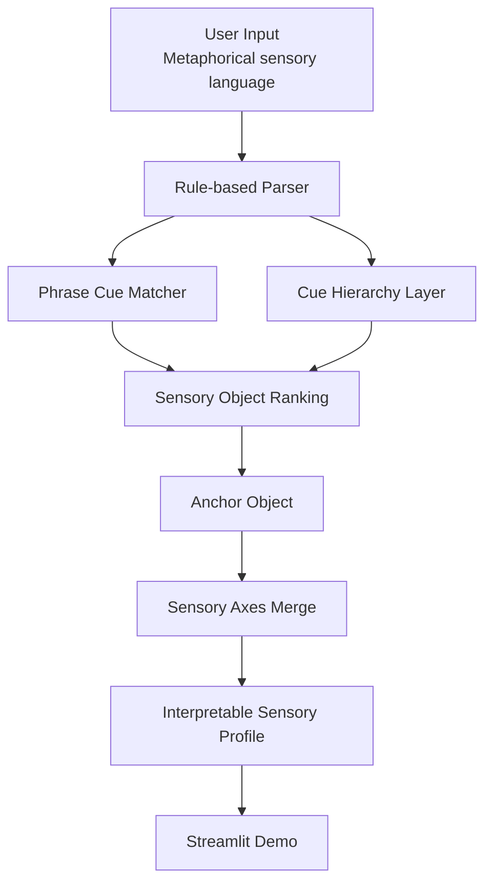
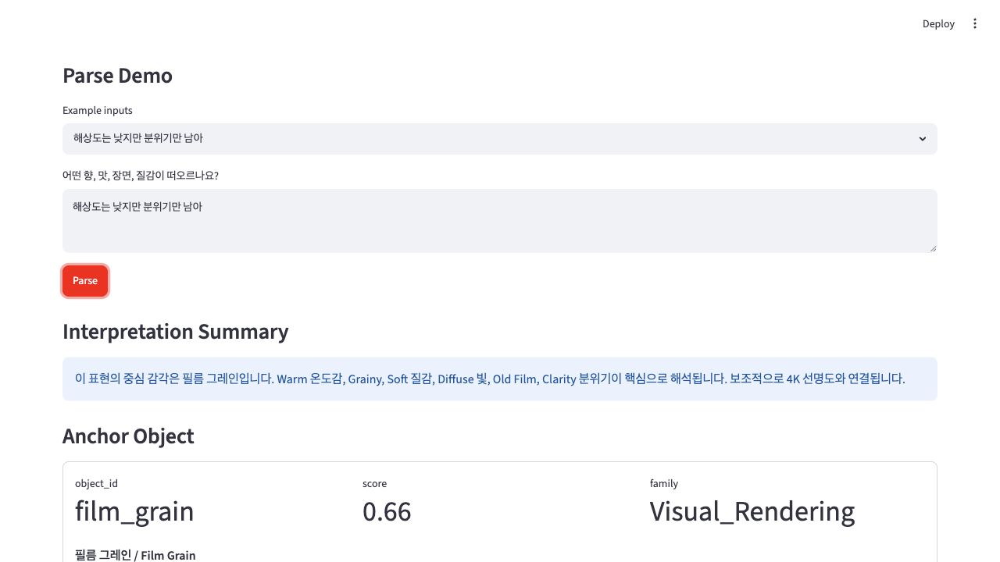
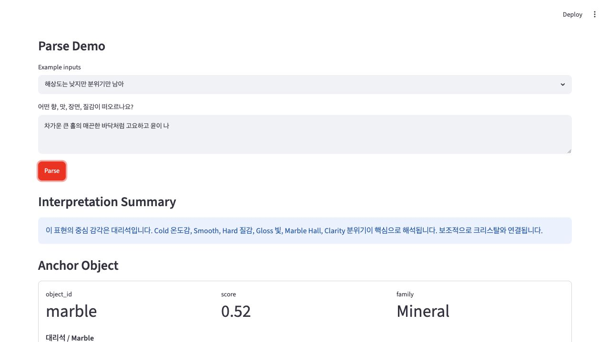
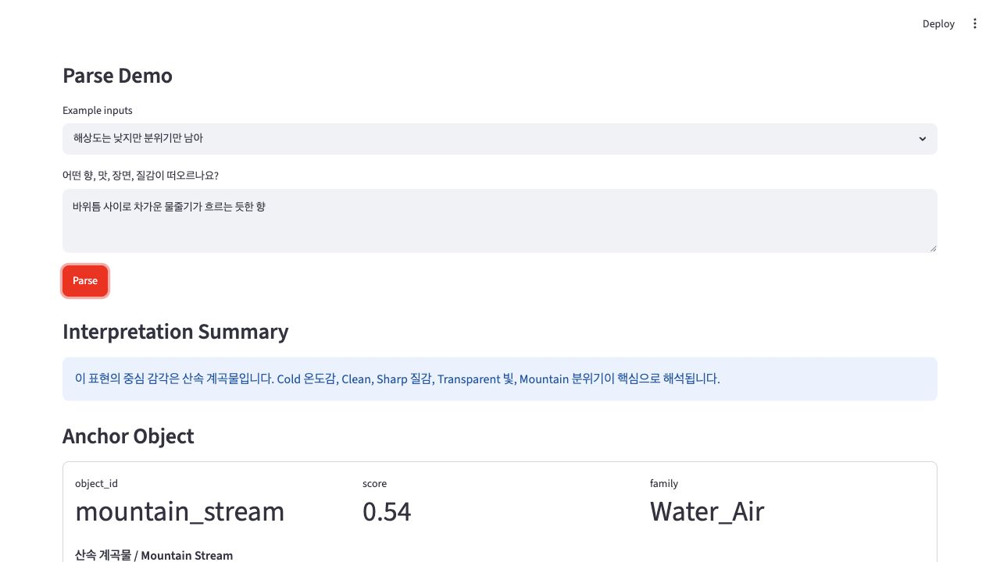
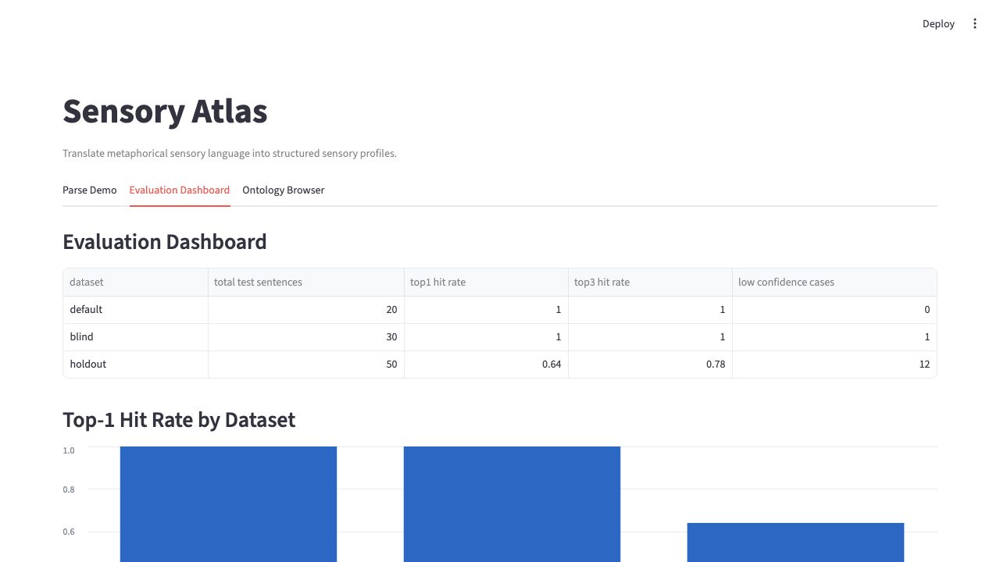
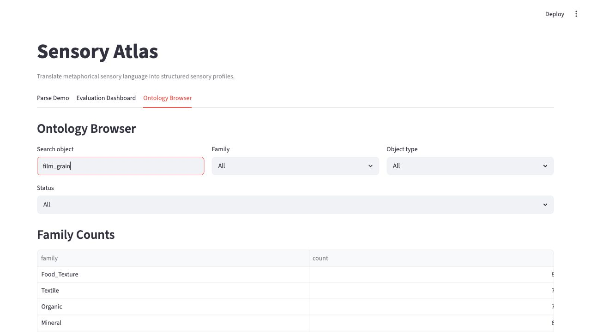

# Sensory Atlas

[English README](README_EN.md)

은유적인 감각 언어를 구조화된 sensory profile로 번역하는 AI parser 프로젝트입니다.

Sensory Atlas는 일반적인 flavor-note recommender가 아닙니다.

이 프로젝트는 사용자의 은유적 감각 표현을 구조화된 sensory object, sensory axis, 해석 가능한 profile로 변환하는 semantic translation layer입니다.

```text
사용자의 은유적 감각 언어
→ sensory parser
→ sensory objects
→ sensory axes
→ cue hierarchy
→ 해석 가능한 sensory profile
→ 향후 recommendation interface
```

## 1. 개요

Sensory Atlas는 맛, 향, 질감, 분위기, 기억, 시각적 렌더링과 같은 감각 표현을 구조화된 profile로 파싱합니다. 현재 버전은 외부 LLM API 없이 로컬에서 실행되는 deterministic rule-based parser, phrase cue matching, cue hierarchy activation, Streamlit demo UI로 구성되어 있습니다.

## 2. 왜 이 프로젝트가 중요한가

대부분의 추천 시스템은 제품 측 descriptor에서 출발합니다.

```text
smoke
vanilla
oak
peat
floral
fruity
```

하지만 사용자는 감각을 이런 식으로 말하는 경우가 많습니다.

```text
11월 말 새벽 공기처럼 차갑고 투명한 느낌
캐시미어 니트처럼 포근하게 감싸는 향
해상도는 낮지만 분위기만 남아 있는 오래된 영화 같은 향
비 온 뒤 계곡 이끼처럼 축축한 초록색 냄새
```

Sensory Atlas는 이런 문장을 막연한 감정 표현으로 보지 않고, 구조화 가능한 감각 신호로 다룹니다.

## 3. 문제 정의

핵심 문제는 semantic translation입니다. 사용자의 은유적 감각 언어를 향후 추천 시스템이 사용할 수 있는 ontology로 어떻게 변환할 수 있을까요?

Sensory Atlas는 바로 제품을 추천하기보다 먼저 다음 질문에 답합니다.

- 이 표현은 어떤 sensory object를 떠올리게 하는가?
- 어떤 감각 축이 활성화되는가?
- 어떤 cue group이 해석을 설명하는가?
- parser의 confidence는 어느 정도인가?

## 4. 핵심 아이디어

핵심 단위는 **sensory object**입니다.

예시:

```text
Cashmere
Cut Diamond
Wet Moss
Winter Dawn
Old Library
Film Grain
4K Clarity
```

각 object는 재사용 가능한 감각 은유이며, 구조화된 axes를 가집니다. 이를 통해 시스템은 단순 tasting note를 넘어 더 풍부한 감각 해석을 수행할 수 있습니다.

## 5. 시스템 구조



## 6. Sensory Ontology

각 sensory object는 다음 축을 포함합니다.

```text
Material
Temperature
Texture
Light
Motion
Time
Atmosphere
Density
Rendering
Organic / Mineral
```

예시:

```json
{
  "object_id": "film_grain",
  "korean_label": "필름 그레인",
  "core_axes": {
    "temperature": "Warm",
    "texture": ["Grainy", "Soft"],
    "light": "Diffuse",
    "time": "Vintage",
    "rendering": "Film-like"
  }
}
```

## 7. Parser Pipeline

현재 parser는 deterministic하고 로컬에서 실행됩니다.

1. `data/sensory_objects.jsonl`에서 sensory object를 로드합니다.
2. 직접 label과 example expression을 매칭합니다.
3. cue hierarchy group을 적용합니다.
4. phrase-level object cue를 적용합니다.
5. sensory object를 ranking합니다.
6. `anchor_object`를 선택합니다.
7. anchor 중심으로 sensory axes를 병합합니다.
8. 해석 가능한 parser output을 반환합니다.

parser output은 의도적으로 `anchor_object`, `detected_objects`, `activated_cue_groups`, `axes`, `confidence`, `low_confidence`를 노출합니다.

## 8. Cue Hierarchy

v0.7에서는 표면 keyword와 문맥적 의미가 충돌할 때 이를 해결하기 위해 cue hierarchy layer를 도입했습니다.

예를 들어:

```text
"해상도는 낮지만 분위기만 남아"
```

표면 단어 `해상도`는 4K-like clarity를 가리킬 수 있습니다. 하지만 주변 문맥은 다른 방향을 말합니다.

```text
low resolution + atmosphere + memory + lingering feeling
→ film_like_rendering
→ film_grain
```

| Cue Group | 역할 | 예시 |
| --- | --- | --- |
| `film_like_rendering` | Film-like ambiguity resolution | 해상도는 낮지만 분위기만 남아 |
| `four_k_clarity` | High-resolution clarity | 4K 화면처럼 입자가 다 보임 |
| `marble_hall_polish` | Cold polished hall / marble | 차가운 큰 홀의 매끈한 바닥 |
| `mountain_water_flow` | Cold stream / wet stone | 바위틈 물줄기 |
| `cold_metal_tension` | Metallic coldness / tension | 차가운 창틀의 긴장감 |

## 9. Streamlit Demo

## 배포된 데모

로컬 설치 없이 아래 링크에서 바로 데모를 확인할 수 있습니다.

[https://sensory-atlas.streamlit.app/](https://sensory-atlas.streamlit.app/)

포트폴리오 문구:

> Sensory Atlas는 사용자의 은유적 감각 표현을 구조화된 감각 객체와 감각 축으로 번역하는 AI parser 프로젝트입니다.
> 데모에서는 사용자가 감각 표현을 입력하면 anchor object, cue group, confidence, sensory profile을 확인할 수 있습니다.

### Parse Demo

사용자가 직접 감각 표현을 입력하고 parser output을 확인할 수 있습니다.

### Evaluation Dashboard

default, blind, holdout evaluation 결과를 비교합니다.

### Ontology Browser

sensory object, family, axis, object 간 관계를 탐색합니다.

### Demo Screenshots

| Parse: film-like rendering | Parse: marble hall polish |
| --- | --- |
|  |  |

| Parse: mountain stream | Evaluation dashboard |
| --- | --- |
|  |  |

| Ontology browser: film grain |
| --- |
|  |

## 10. 평가 전략

Sensory Atlas는 하나의 accuracy 숫자만으로 평가하지 않습니다.

단계별 evaluation을 사용합니다.

1. `default` — ontology sanity check
2. `blind` — phrase-level generalization
3. `holdout` — stricter metaphor generalization

holdout set은 의도적으로 어렵게 설계되어 있습니다. 목적은 성능을 부풀리는 것이 아니라 parser의 한계를 드러내는 것입니다.

| Dataset | 목적 | Total | Top-1 | Top-3 | Low Confidence |
| --- | --- | ---: | ---: | ---: | ---: |
| default | Ontology sanity check | 20 | 1.00 | 1.00 | 0 |
| blind | Phrase-level generalization | 30 | 1.00 | 1.00 | 0 |
| holdout | Stricter metaphor generalization | 50 | 0.78 | 0.88 | 6 |

## 11. 결과

이 프로젝트는 ontology, cue, evaluation strategy가 명시적일 때 deterministic parser도 유용한 semantic translation layer가 될 수 있음을 보여줍니다.

주요 발견:

- Cue hierarchy는 문맥 의존적 감각 해석을 개선합니다.
- v1.0 ontology coverage 확장은 parser logic을 바꾸지 않고도 sparse object recall을 개선했습니다.
- Holdout evaluation은 parser의 실제 한계를 드러냅니다.
- Low-confidence output은 단순 실패가 아니라 제품적으로 유용한 신호입니다.
- 시스템은 surface cue와 abstract cue group이 함께 정렬될 때 가장 강합니다.

## v1.0 — Ontology Data Coverage Expansion

- 모든 sensory object의 example expression을 확장했습니다.
- 약하거나 누락된 object의 phrase cue를 보강했습니다.
- ontology annotation guideline을 추가했습니다.
- 향후 parser iteration을 위한 dev failure case를 추가했습니다.
- ontology coverage test를 추가했습니다.

자세한 내용은 [Ontology Annotation Guidelines](docs/ontology_annotation_guidelines.md)와 [v1.0 Data Coverage Report](docs/v1_0_data_coverage_report.md)를 참고하세요.

## v1.1 — Domain Vocabulary Expansion

- 향수, 위스키, 와인, 커피, cross-domain 감각 언어를 위한 domain vocabulary seed를 추가했습니다.
- 향후 ontology 확장을 위한 candidate sensory object layer를 추가했습니다.
- note / accord / tasting descriptor를 Sensory Atlas object와 axes에 연결하는 domain mapping layer를 추가했습니다.
- domain vocabulary data quality test를 추가했습니다.

자세한 내용은 [Domain Vocabulary Expansion](docs/domain_vocabulary_expansion.md)을 참고하세요.

## v1.2 — General Sensory Vocabulary Layer

- 일반 cross-domain sensory vocabulary layer를 추가했습니다.
- temperature, texture, density, clarity, motion, atmosphere, rendering, balance 등 축별 descriptor를 추가했습니다.
- `cold_clear`, `wet_green`, `dry_smoky`, `film_like_mood`, `skin_like_softness` 같은 modifier group을 추가했습니다.
- 향후 parser refinement를 위한 sensory expression pattern을 추가했습니다.

자세한 내용은 [General Sensory Vocabulary Layer](docs/general_sensory_vocabulary_layer.md)를 참고하세요.

## v1.3 — Axis Evidence & Clarification Layer

- parser output에 axis-level evidence를 추가했습니다.
- heuristic axis confidence score를 추가했습니다.
- low-confidence 또는 ambiguous sensory expression에 대한 clarification question을 추가했습니다.
- Streamlit demo에서 axis evidence와 clarification prompt를 확인할 수 있게 했습니다.

자세한 내용은 [Axis Evidence & Clarification Layer](docs/axis_evidence_clarification_layer.md)를 참고하세요.

## v1.4 — Candidate Sensory Object Review Workflow

- candidate object review workflow를 추가했습니다.
- candidate sensory object에 대한 heuristic readiness scoring을 추가했습니다.
- candidate와 기존 ontology object의 rule-based comparison을 추가했습니다.
- read-only Streamlit Candidate Review tab을 추가했습니다.
- 자동 ontology 병합 없이 promotion draft를 생성할 수 있게 했습니다.

자세한 내용은 [Candidate Sensory Object Review Workflow](docs/candidate_object_review_workflow.md)를 참고하세요.

## v1.4.1 — Curated Candidate Shortlist

- ready candidate sensory object 중 v1.5 수동 검토용 10–12개 shortlist를 선별했습니다.
- shortlist 생성 CLI를 추가했습니다.
- shortlist report와 summary output을 추가했습니다.
- ontology 품질을 유지하기 위해 main ontology는 변경하지 않았습니다.

자세한 내용은 [Curated Candidate Shortlist](docs/curated_candidate_shortlist_v1_4_1.md)를 참고하세요.

## 버전 히스토리

| Version | Summary |
| --- | --- |
| v0.5 | phrase cue parser |
| v0.6 | holdout evaluation + error taxonomy |
| v0.7 | cue hierarchy abstraction layer |
| v0.8 | Streamlit demo MVP |
| v0.9 | portfolio packaging |
| v1.0 | ontology data coverage expansion |
| v1.0.1 | README quickstart fix |
| v1.1 | domain vocabulary expansion layer |
| v1.2 | general sensory vocabulary layer |
| v1.3 | axis evidence + clarification layer |
| v1.4 | candidate object review workflow |
| v1.4.1 | curated candidate shortlist |

## 12. 프로젝트 구조

```text
sensory-atlas/
├── app/
│   └── streamlit_app.py
├── assets/
│   └── screenshots/
├── data/
│   ├── sensory_objects.jsonl
│   ├── phrase_cues.json
│   ├── cue_hierarchy.json
│   ├── domain_mapping.json
│   ├── domain_vocabulary_seed.csv
│   ├── dev_failure_cases.jsonl
│   ├── general_sensory_vocabulary.csv
│   ├── sensory_object_candidates.jsonl
│   ├── sensory_axis_descriptors.json
│   ├── sensory_expression_patterns.jsonl
│   ├── sensory_modifier_groups.json
│   ├── curated_candidate_shortlist_v1_5.jsonl
│   ├── test_sentences_20.jsonl
│   ├── blind_test_sentences_30.jsonl
│   └── holdout_test_sentences_50.jsonl
├── docs/
│   ├── architecture.md
│   ├── demo_script.md
│   ├── domain_vocabulary_expansion.md
│   ├── evaluation_strategy.md
│   ├── general_sensory_vocabulary_layer.md
│   ├── ontology_annotation_guidelines.md
│   ├── portfolio_case_study.md
│   ├── screenshot_guide.md
│   └── v1_0_data_coverage_report.md
├── outputs/
├── src/
│   └── sensory_atlas/
└── tests/
```

## 13. 로컬에서 실행하기

아래 순서대로 실행하면 로컬 환경에서 Sensory Atlas 데모를 실행할 수 있습니다.

### 1. 저장소 클론하기

```bash
git clone https://github.com/jeesy95-creator/sensory-atlas.git
cd sensory-atlas
```

### 2. 가상환경 생성 및 활성화

macOS / Linux:

```bash
python -m venv .venv
source .venv/bin/activate
```

Windows PowerShell:

```powershell
python -m venv .venv
.venv\Scripts\Activate.ps1
```

### 3. 의존성 설치

```bash
pip install -e ".[dev]"
```

### 4. Streamlit 데모 실행

```bash
streamlit run app/streamlit_app.py
```

실행 후 터미널에 표시되는 주소로 접속하면 됩니다. 일반적으로 아래 주소에서 확인할 수 있습니다.

```text
http://localhost:8501
```

## 14. CLI 사용법

온톨로지 데이터 검증:

```bash
python -m sensory_atlas.cli validate-data
```

예시 문장 파싱 실행:

```bash
python -m sensory_atlas.cli dry-run
```

평가 실행:

```bash
python -m sensory_atlas.cli evaluate --dataset default
python -m sensory_atlas.cli evaluate --dataset blind
python -m sensory_atlas.cli evaluate --dataset holdout
```

테스트 실행:

```bash
pytest
```

## 15. 예시 입력

예시 1:

```text
Input:
해상도는 낮지만 분위기만 남아

Output:
anchor_object: film_grain
rendering: Film-like
activated cue group: film_like_rendering
```

예시 2:

```text
Input:
차가운 큰 홀의 매끈한 바닥처럼 고요하고 윤이 나

Output:
anchor_object: marble
light: Gloss
texture: Smooth / Hard / Clean
activated cue group: marble_hall_polish
```

예시 3:

```text
Input:
바위틈 사이로 차가운 물줄기가 흐르는 듯한 향

Output:
anchor_object: mountain_stream
motion: Flow / Rise
activated cue group: mountain_water_flow
```

## 16. 한계

- parser는 아직 rule-based이며 embedding이나 LLM을 사용하지 않습니다.
- 현재 cue group 설계 범위를 벗어나는 은유는 놓칠 수 있습니다.
- 일부 atmosphere 표현은 넓은 scene object로 과매칭될 수 있습니다.
- holdout 성능은 의도적으로 1.00에 맞추어 최적화하지 않습니다.
- 아직 product recommendation logic은 포함되어 있지 않습니다.

## 17. 다음 단계

- candidate sensory object workflow 추가
- clarification answer를 parser refinement에 반영
- 동일 schema 뒤에 embedding 또는 LLM-assisted parsing 실험
- sensory profile 위에 recommendation interface 구축

## 18. 기술 스택

- Python 3.11+
- Pydantic
- pandas
- Streamlit
- pytest
- JSONL/JSON seed ontology
- Deterministic rule-based parser

## 문서

- [Portfolio Case Study](docs/portfolio_case_study.md)
- [Architecture](docs/architecture.md)
- [Evaluation Strategy](docs/evaluation_strategy.md)
- [Domain Vocabulary Expansion](docs/domain_vocabulary_expansion.md)
- [Axis Evidence & Clarification Layer](docs/axis_evidence_clarification_layer.md)
- [Candidate Sensory Object Review Workflow](docs/candidate_object_review_workflow.md)
- [General Sensory Vocabulary Layer](docs/general_sensory_vocabulary_layer.md)
- [Ontology Annotation Guidelines](docs/ontology_annotation_guidelines.md)
- [v1.0 Data Coverage Report](docs/v1_0_data_coverage_report.md)
- [Demo Script](docs/demo_script.md)
- [Screenshot Guide](docs/screenshot_guide.md)
