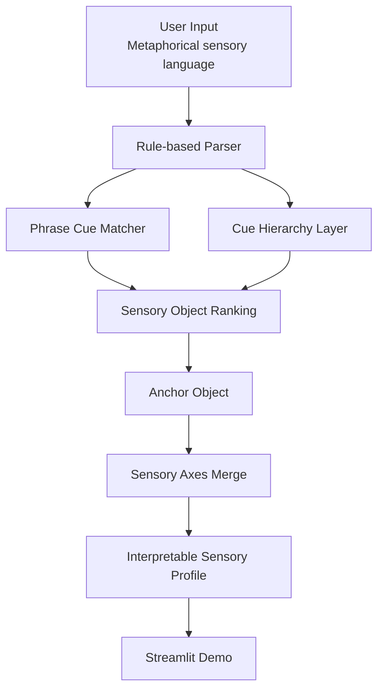

# Sensory Atlas

Translate metaphorical sensory language into structured sensory profiles.

Sensory Atlas is not a conventional flavor-note recommender.

It is a semantic translation layer that maps users' metaphorical sensory language into structured sensory objects, sensory axes, and interpretable profiles.

```text
User metaphorical sensory language
→ sensory parser
→ sensory objects
→ sensory axes
→ cue hierarchy
→ interpretable sensory profile
→ future recommendation interface
```

## 1. Overview

Sensory Atlas parses sensory expressions such as taste, scent, texture, atmosphere, memory, and visual rendering into a structured profile. It currently runs fully locally with a deterministic rule-based parser, phrase cue matching, cue hierarchy activation, and Streamlit demo UI.

## 2. Why This Project Matters

Most recommendation systems start from product-side descriptors:

```text
smoke
vanilla
oak
peat
floral
fruity
```

But users often describe sensation through metaphor:

```text
11월 말 새벽 공기처럼 차갑고 투명한 느낌
캐시미어 니트처럼 포근하게 감싸는 향
해상도는 낮지만 분위기만 남아 있는 오래된 영화 같은 향
비 온 뒤 계곡 이끼처럼 축축한 초록색 냄새
```

Sensory Atlas treats these not as vague emotional sentences, but as structured sensory signals.

## 3. Problem Statement

The core problem is semantic translation: how can metaphorical sensory language be mapped into an ontology that future recommendation systems can use?

Instead of immediately recommending products, Sensory Atlas first asks:

- What sensory object does the expression evoke?
- Which axes are active?
- Which cue groups explain the interpretation?
- How confident is the parser?

## 4. Core Idea

The core unit is the **sensory object**.

Examples:

```text
Cashmere
Cut Diamond
Wet Moss
Winter Dawn
Old Library
Film Grain
4K Clarity
```

Each object represents a reusable sensory metaphor with structured axes. This allows the system to reason beyond flat tasting notes.

## 5. System Architecture



## 6. Sensory Ontology

Each sensory object contains:

```text
Material
Temperature
Texture
Light
Motion
Time
Atmosphere
Density
Rendering
Organic / Mineral
```

Example:

```json
{
  "object_id": "film_grain",
  "korean_label": "필름 그레인",
  "core_axes": {
    "temperature": "Warm",
    "texture": ["Grainy", "Soft"],
    "light": "Diffuse",
    "time": "Vintage",
    "rendering": "Film-like"
  }
}
```

## 7. Parser Pipeline

The current parser is deterministic and local:

1. Load sensory objects from `data/sensory_objects.jsonl`
2. Match direct labels and example expressions
3. Apply cue hierarchy groups
4. Apply phrase-level object cues
5. Rank sensory objects
6. Select an `anchor_object`
7. Merge sensory axes around the anchor
8. Return an interpretable parser output

The parser intentionally exposes `anchor_object`, `detected_objects`, `activated_cue_groups`, `axes`, `confidence`, and `low_confidence`.

## 8. Cue Hierarchy

v0.7 introduced a cue hierarchy layer to resolve conflicts between surface keywords and contextual meaning.

For example:

```text
"해상도는 낮지만 분위기만 남아"
```

The surface word `해상도` can point toward 4K-like clarity. But the surrounding context says:

```text
low resolution + atmosphere + memory + lingering feeling
→ film_like_rendering
→ film_grain
```

| Cue Group | Purpose | Example |
| --- | --- | --- |
| `film_like_rendering` | Film-like ambiguity resolution | 해상도는 낮지만 분위기만 남아 |
| `four_k_clarity` | High-resolution clarity | 4K 화면처럼 입자가 다 보임 |
| `marble_hall_polish` | Cold polished hall / marble | 차가운 큰 홀의 매끈한 바닥 |
| `mountain_water_flow` | Cold stream / wet stone | 바위틈 물줄기 |
| `cold_metal_tension` | Metallic coldness / tension | 차가운 창틀의 긴장감 |

## 9. Streamlit Demo

Live demo: [https://sensory-atlas.streamlit.app/](https://sensory-atlas.streamlit.app/)

Portfolio copy:

> Sensory Atlas는 사용자의 은유적 감각 표현을 구조화된 감각 객체와 감각 축으로 번역하는 AI parser 프로젝트입니다.
> 데모에서는 사용자가 감각 표현을 입력하면 anchor object, cue group, confidence, sensory profile을 확인할 수 있습니다.

Run:

```bash
pip install -e ".[dev]"
streamlit run app/streamlit_app.py
```

### Parse Demo

Try custom sensory expressions and inspect parser outputs.

### Evaluation Dashboard

Compare default, blind, and holdout evaluation results.

### Ontology Browser

Explore sensory objects, families, axes, and relationships.

### Demo Screenshots

| Parse: film-like rendering | Parse: marble hall polish |
| --- | --- |
|  |  |

| Parse: mountain stream | Evaluation dashboard |
| --- | --- |
|  |  |

| Ontology browser: film grain |
| --- |
|  |

## 10. Evaluation Strategy

Sensory Atlas is not evaluated with a single accuracy number.

It uses staged evaluation:

1. `default` — ontology sanity check
2. `blind` — phrase-level generalization
3. `holdout` — stricter metaphor generalization

The holdout set is intentionally difficult. Its purpose is to reveal parser limitations rather than inflate performance.

| Dataset | Purpose | Total | Top-1 | Top-3 | Low Confidence |
| --- | --- | ---: | ---: | ---: | ---: |
| default | Ontology sanity check | 20 | 1.00 | 1.00 | 0 |
| blind | Phrase-level generalization | 30 | 1.00 | 1.00 | 0 |
| holdout | Stricter metaphor generalization | 50 | 0.78 | 0.88 | 6 |

## 11. Results

The project shows that a deterministic parser can be useful when the ontology, cues, and evaluation strategy are explicit.

Key findings:

- Cue hierarchy improves context-sensitive interpretation.
- v1.0 ontology coverage improves sparse object recall without changing parser logic.
- Holdout evaluation reveals real parser limits.
- Low-confidence outputs are useful product signals, not just failures.
- The system is strongest when surface cues and abstract cue groups align.

## v1.0 — Ontology Data Coverage Expansion

- Expanded example expressions for all sensory objects.
- Added phrase cues for weak or missing objects.
- Added ontology annotation guidelines.
- Added dev failure cases for future parser iteration.
- Added ontology coverage tests.

See [Ontology Annotation Guidelines](docs/ontology_annotation_guidelines.md) and [v1.0 Data Coverage Report](docs/v1_0_data_coverage_report.md).

## 12. Project Structure

```text
sensory-atlas/
├── app/
│   └── streamlit_app.py
├── assets/
│   └── screenshots/
├── data/
│   ├── sensory_objects.jsonl
│   ├── phrase_cues.json
│   ├── cue_hierarchy.json
│   ├── dev_failure_cases.jsonl
│   ├── test_sentences_20.jsonl
│   ├── blind_test_sentences_30.jsonl
│   └── holdout_test_sentences_50.jsonl
├── docs/
│   ├── architecture.md
│   ├── demo_script.md
│   ├── evaluation_strategy.md
│   ├── ontology_annotation_guidelines.md
│   ├── portfolio_case_study.md
│   ├── screenshot_guide.md
│   └── v1_0_data_coverage_report.md
├── outputs/
├── src/
│   └── sensory_atlas/
└── tests/
```

## 13. How to Run

```bash
cd /Users/jisoyun/Desktop/sensory-atlas
python3 -m venv .venv
source .venv/bin/activate
python -m pip install -e ".[dev]"
```

Validate data:

```bash
python -m sensory_atlas.cli validate-data
```

Run parser dry run:

```bash
python -m sensory_atlas.cli dry-run
```

Run evaluations:

```bash
python -m sensory_atlas.cli evaluate --dataset default
python -m sensory_atlas.cli evaluate --dataset blind
python -m sensory_atlas.cli evaluate --dataset holdout
```

Run tests:

```bash
pytest
```

Run Streamlit:

```bash
streamlit run app/streamlit_app.py
```

## 14. Example Inputs

Example 1:

```text
Input:
해상도는 낮지만 분위기만 남아

Output:
anchor_object: film_grain
rendering: Film-like
activated cue group: film_like_rendering
```

Example 2:

```text
Input:
차가운 큰 홀의 매끈한 바닥처럼 고요하고 윤이 나

Output:
anchor_object: marble
light: Gloss
texture: Smooth / Hard / Clean
activated cue group: marble_hall_polish
```

Example 3:

```text
Input:
바위틈 사이로 차가운 물줄기가 흐르는 듯한 향

Output:
anchor_object: mountain_stream
motion: Flow / Rise
activated cue group: mountain_water_flow
```

## 15. Limitations

- The parser is still rule-based and does not use embeddings or an LLM.
- Cue groups can miss metaphors outside the current design space.
- Some atmospheric expressions over-match broad scene objects.
- Holdout performance is intentionally not optimized to 1.00.
- The project does not yet include product recommendation logic.

## 16. Next Steps

- Add axis-level evidence and confidence per axis
- Add user confirmation questions for low-confidence outputs
- Add a candidate sensory object workflow
- Explore embedding or LLM-assisted parsing behind the same schema
- Build a recommendation interface on top of sensory profiles

## 17. Tech Stack

- Python 3.11+
- Pydantic
- pandas
- Streamlit
- pytest
- JSONL/JSON seed ontology
- Deterministic rule-based parser

## Documentation

- [Portfolio Case Study](docs/portfolio_case_study.md)
- [Architecture](docs/architecture.md)
- [Evaluation Strategy](docs/evaluation_strategy.md)
- [Ontology Annotation Guidelines](docs/ontology_annotation_guidelines.md)
- [v1.0 Data Coverage Report](docs/v1_0_data_coverage_report.md)
- [Demo Script](docs/demo_script.md)
- [Screenshot Guide](docs/screenshot_guide.md)
