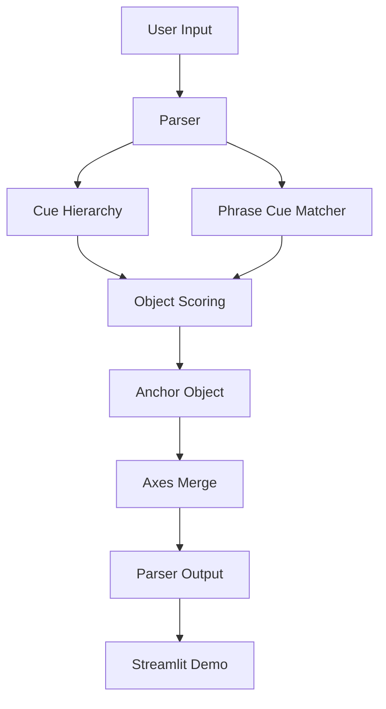

# Architecture

## Pipeline



## Main Modules

- `schema.py`: Pydantic models for sensory objects, axes, parser output, cue groups
- `loaders.py`: JSONL loading and validation
- `matcher.py`: deterministic object scoring
- `cue_hierarchy.py`: abstract cue group activation and score adjustment
- `parser.py`: anchor selection, axes merge, summary generation
- `evaluator.py`: dataset evaluation, hit rates, failure taxonomy
- `ui_helpers.py`: display transforms for Streamlit
- `cli.py`: dry run, data validation, evaluation commands

## Data Files

- `data/sensory_objects.jsonl`: sensory ontology seed objects
- `data/phrase_cues.json`: object-level phrase cues
- `data/cue_hierarchy.json`: abstract cue groups
- `data/test_sentences_20.jsonl`: default sanity set
- `data/blind_test_sentences_30.jsonl`: blind phrase-level set
- `data/holdout_test_sentences_50.jsonl`: stricter holdout set

## Parser Flow

1. Load sensory ontology
2. Score objects with direct labels, examples, phrase cues, and definition overlap
3. Activate cue hierarchy groups
4. Apply cue group boost and penalty
5. Rank detected objects
6. Select top object as anchor
7. Merge axes around anchor object
8. Apply strong cue hierarchy axis updates
9. Return interpretable `ParserOutput`

## Cue Hierarchy Flow

```text
surface cues
→ positive / negative cue matching
→ activation score
→ boost / penalty objects
→ axis updates
→ parser output debug trace
```

## Streamlit Demo Flow

The Streamlit app has three tabs:

- Parse Demo: input text, parser output, axes, cue groups
- Evaluation Dashboard: default/blind/holdout metrics and charts
- Ontology Browser: searchable sensory object explorer
